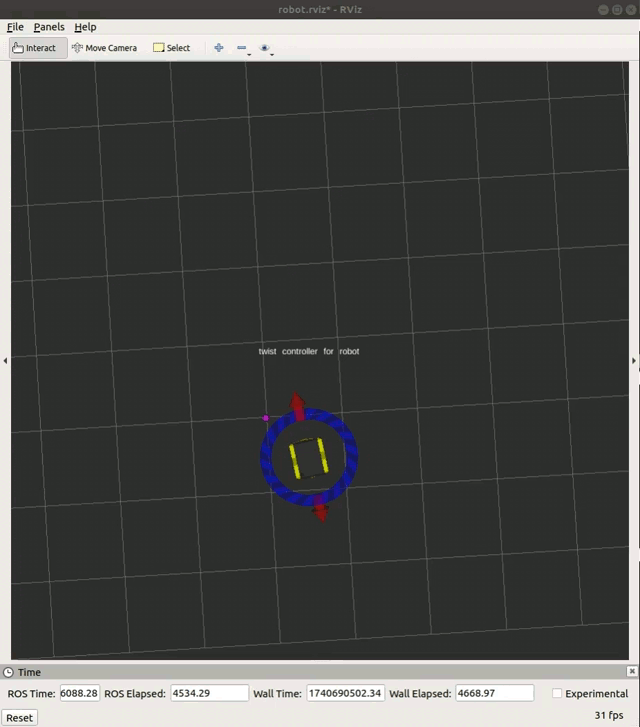
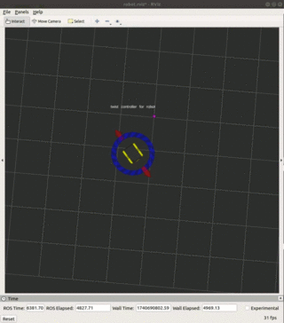

# Jackal Project

This project demonstrates how the Jackal robot repels from the purple point shown in the clips below.

## Behavior Demonstration
The Jackal moves in a way to avoid or repel from a specific point in its environment. The purple point represents a virtual repelling force, and the robot’s motion is adjusted accordingly.

### Demonstration Clips

  
*The Jackal starts moving away from the purple point.*

  
*The Jackal continues to navigate while avoiding the repelling point.*

