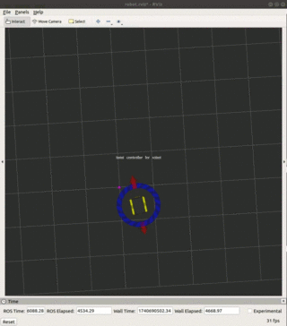

# Jackal Project

## Behavior Demonstration
The Jackal moves in a way to repel from a specific point in its environment. The purple point represents a virtual repelling force, and the robot’s motion is adjusted accordingly.

### Demonstration Clips

*The Jackal repels from the purple point.*

  

*The Jackal repels from the purple point.*

  

